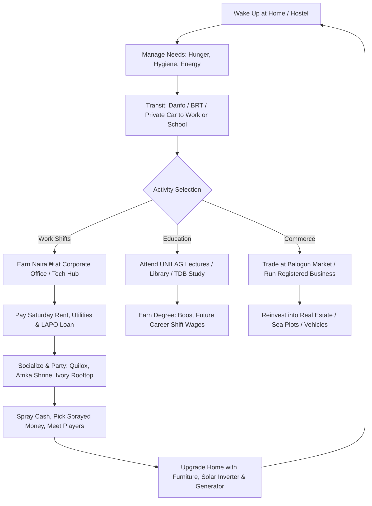

# Lagos Life — Game Design & Systems Analysis

## 1. Core Game Loop
Lagos Life models the daily rhythm of urban survival, status ascension, and social networking in Nigeria's commercial capital:

---

## 2. Character Stats & Needs System
The player avatar maintains standard life simulation vitals that decay over time:
- **Hunger**: Replenished by dining at *Amala Shitta*, buka joints, or home cooking (Jollof rice, Amala & Ewedu, Suya, Pepper soup, Shawarma). Food left in unpowered fridges during NEPA blackouts spoils.
- **Energy**: Restored by sleeping on a Vono single mattress or luxury King Bed. Drained by intercity road trips, long shifts, and clubbing.
- **Hygiene**: Restored by bathing with a bucket in the hostel or showering in luxury apartments. Drained by long night bus commutes and gym workouts.
- **Fun**: Restored by visiting Freedom Park, dancing at Quilox, streaming live radio stations, or gaming at Eko Casino.
- **Social**: Boosted by chatting with other online Lagosians, visiting friends' homes, knocking on doors, and attending Owambe parties.

---

## 3. Economic Systems & Wealth Progression

### A. Starting Origins
Players can choose their demographic starting condition, mimicking real Nigerian social strata:
1. **Ajegunle Hustler**: Starts with ₦5,000 cash. Highest grit and street resilience; must grind local jobs.
2. **Surulere Middle Class**: Starts with ₦25,000 cash. Balanced safety net.
3. **Yaba Tech Bro**: Starts with ₦50,000 cash. Comes with a laptop, quick access to CcHub, and remote work options.
4. **Ikoyi Nepo Baby**: Starts with ₦500,000 cash. High social status, automatic access to a Toyota Prado, and substantial family allowance.

### B. Business & Entrepreneurship (`/api/company`)
- Players can register up to 3 companies with up to 4 branches across Lagos.
- Registration fee: ₦50,000.
- Business parameters extracted from engine:
  - 5% tax rate paid to the Lagos State Treasury.
  - Cashouts allowed up to 30 times daily.
  - Resale value: 60% of enterprise valuation.
  - Value multiplier: 3x on 30-day performance.

### C. Banking & Loans (`/api/bank`)
- **Lagos Life Bank**: Holds liquid savings and earns periodic interest.
- **LAPO Microfinance Loans**: Allows immediate emergency liquidity with a 5% weekly interest charge. Failure to repay triggers bad debt penalties and asset garnishing.

### D. The Forbes Leaderboard (`/api/forbes`)
- Ranks the richest players across the game by total Net Worth.
- Net Worth formula:
  $$\text{Net Worth} = \text{Cash} + \text{Bank Balance} + \text{Furniture} + \text{Vehicles} + \text{Homes} + \text{Businesses} + \text{Sea Plots}$$

---

## 4. Housing & Real Estate Mechanics

### A. The 400 Homes (`/api/homes`)
There are exactly 400 physical player homes permanently rendered across Lagos Island and Mainland:
- **Mushin**: Budget starting apartments (rent: ₦8,000 – ₦15,000/week).
- **Yaba**: Student and tech apartments near UNILAG & CcHub (rent: ₦25,000 – ₦45,000/week).
- **Surulere**: Vibrant cultural hub near Shitta & Stadium.
- **Lekki**: Modern serviced duplexes with estate security (rent: ₦100,000 – ₦250,000/week).
- **Ikoyi & Victoria Island**: Ultra-luxury waterfront mansions (rent: ₦500,000 – ₦1,500,000/week).

### B. Evictions & Storage
- Rent is automatically deducted every Saturday.
- If a player misses 2 consecutive weeks of rent, the landlord evicts them, changes the lock, and places all their furniture into storage.

### C. Buy Mode & Interior Decoration
When inside their home, players enter "Buy Mode" using keyboard shortcuts:
- `← ↑ → ↓`: Move furniture across the room grid
- `R`: Rotate item by 90°
- `Enter`: Confirm placement
- `Del`: Sell furniture back for 70% value
- `C`: Open furniture catalogue

---

## 5. University Life at UNILAG (`/api/campus`)
UNILAG is modeled as a complete educational subsystem:
- **Senate Building**: Course registration, matriculation oath, school fees payment.
- **Academic Schedule**: Lectures run daily between 8 AM and 8 PM.
- **ASUU Strike Mechanic**: Random strikes by the Academic Staff Union of Universities halt all lectures and exams until government negotiations succeed.
- **Degree Honours Multiplier**:
  - **First Class Honours (🥇)**: +20% permanent salary bonus on all career shifts.
  - **Second Class Upper (2:1, 🥈)**: +12% salary bonus.
  - **Second Class Lower (2:2, 🥉)**: +6% salary bonus.
  - **Third Class (🎓)**: +3% salary bonus.

---

## 6. Politics, Government & Public Policy (`/api/gov`)
Lagos Life features a democratic political simulation:
- **Electoral Cycle**: Regular elections for Lagos State Governor and Senate seats.
- **Candidacy**: Any player with sufficient net worth and civic standing can register to run (3,081 active candidates registered in latest data!).
- **Campaign Promises & Slogans**: Candidates post manifestos to win votes from the 100k+ players.
- **Governor Decrees**: The elected Governor can set statewide public policy and budget allocation:
  - Example policy decree currently active: *"Steady light is law this week"* (reduces NEPA power outage frequency statewide).
  - Governor broadcasts official state announcements directly to the top banner of every player's screen.
